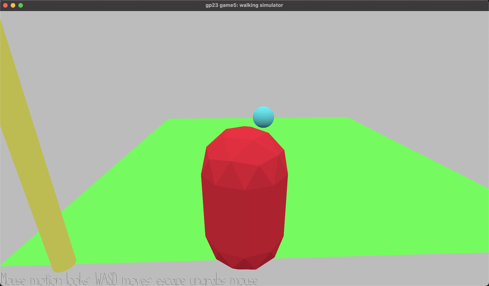

# Goalkeeper Training

Author: Messi Tu

Design: The game is to train the player to become a world-class goalkeeper with exceptional reaction time.

Screen Shot:

How To Play:

(TODO: describe the controls and (if needed) goals/strategy.)
Use WASD to control the movement of the goalkeeper. Try to stand right in front of the goal and try to save as many penalties as possible. Don't cheat by standing right in front of the ball spawning position!

Sources: (TODO: list a source URL for any assets you did not create yourself. Make sure you have a license for the asset.)
codes reference: https://15466.courses.cs.cmu.edu/lesson/walkmesh
(in class code share)

This game was built with [NEST](NEST.md).

